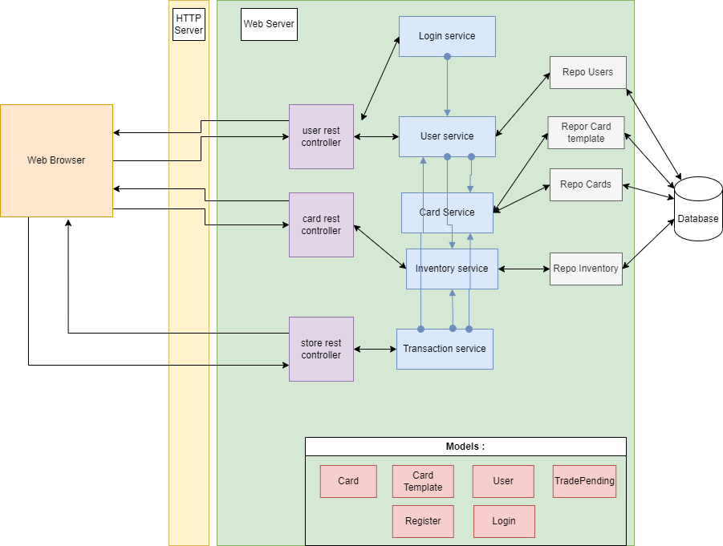
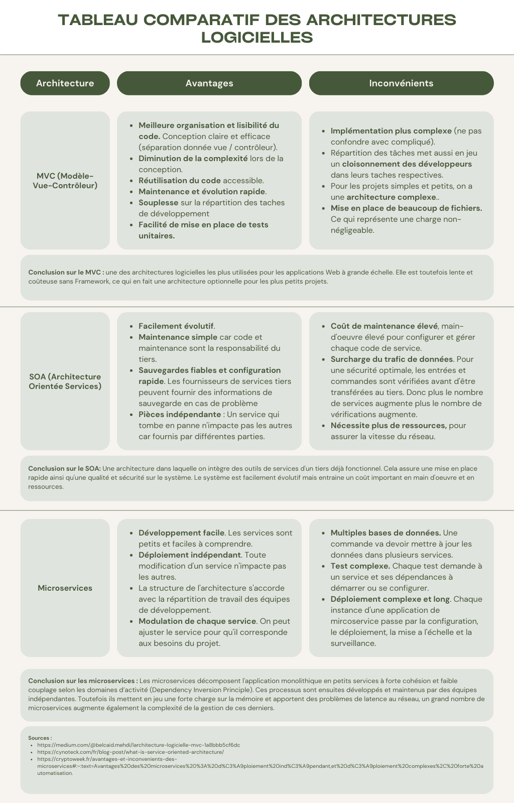

**Author**: Thomas Gabriel,Matéo Pain, Adrien Chausson, Pierre Gosson, All rights reserved
# Projet ASI, site de combat, d'achat et de vente de cartes. 
## Atelier 1 : Création d’un projet de jeu de plateau sur une application web : Mise en place de la création de carte d'affichage et de retour aléatoire de carte.

Nous sommes en phase de création d’un projet de jeu de plateau sur une application web. En tant que
responsable projet de cette application nous souhaitons explorer deux méthodes pour représenter
l’IHM :
* Utilisation de Web Statique en interaction avec un Web Service existant via javascript et AJAX.
* Utilisation du Web Dynamique en utilisant la technologie Springboot et tout particulièrement les Thymeleaf et les Services.
En s’aidant des APIs mises à votre disposition, nous allons creer un formulaire de saisie d’information pour la création d’une nouvelle carte, ainsi qu’une page d’affichage d’une carte en Web Statique + Web Service (existant). 

L'approche Web statique + Web service et l'approche Web dynamique sont deux approches de développement Web qui présentent des avantages et des inconvénients.

L'approche Web statique + Web service consiste à créer des pages Web statiques qui sont ensuite appelées par un Web service pour fournir des données dynamiques. Cette approche présente plusieurs avantages :

Avantages :

Séparation claire entre le front-end et le back-end, ce qui facilite la maintenance et les mises à jour du site Web.
Les pages Web statiques peuvent être mises en cache pour améliorer les performances.
Les données dynamiques sont fournies par un Web service qui peut être développé indépendamment de la partie front-end.
Cependant, cette approche présente également quelques inconvénients :
Inconvénients :

La gestion de la sécurité est plus complexe, car le back-end doit être accessible depuis Internet.
Les interactions utilisateur en temps réel peuvent être difficiles à gérer.
Les mises à jour du contenu nécessitent des appels supplémentaires au Web service, ce qui peut ralentir le site.

L'approche Web dynamique consiste à créer des pages Web dynamiques qui sont générées à la volée par un serveur Web en fonction des données en temps réel. Cette approche présente également des avantages et des inconvénients.

Avantages :

La gestion de la sécurité est plus simple, car la partie back-end n'est pas directement accessible depuis Internet.
Les interactions utilisateur en temps réel peuvent être facilement gérées.
Les mises à jour du contenu peuvent être effectuées sans avoir à recharger la page entière.
Inconvénients :

Le coût de développement est souvent plus élevé, car il faut développer à la fois le front-end et le back-end.
Les performances peuvent être moins bonnes si le serveur Web doit générer des pages Web dynamiques pour chaque requête.
En fin de compte, le choix entre une approche Web statique + Web service et une approche Web dynamique dépend des besoins spécifiques du projet. Il est important d'évaluer les avantages et les inconvénients de chaque approche et de choisir celle qui convient le mieux.

## Atelier 2 : Mise en place de la connexion utilisateur, achat et vente de carte.

Après analyse de nos premiers prototypes nous allons partir sur une architecture Web Javascript + Web Services Full Rest.
La prochaine étape est de bâtir une plateforme d’achat/vente de cartes.
> Après inscription des utilisateurs, ces derniers recevront aléatoirement 5 cartes de jeu.
> Après s’être connectés, les utilisateurs pourront acheter ou vendre des cartes.

Nous allons réalisé les fonctionnalités suivantes :
* Création d’utilisateur et connexion
* Achat/vente de cartes sur la plateforme

Dans un premier temps nous aurons une authentification sommaire sans utiliser Springboot Security.

Schéma de notre architecture de site web : 

  

Tableau comparatif des différents types d'architecture : 

  

