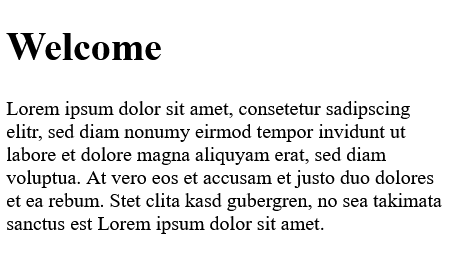
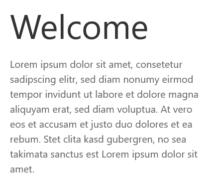
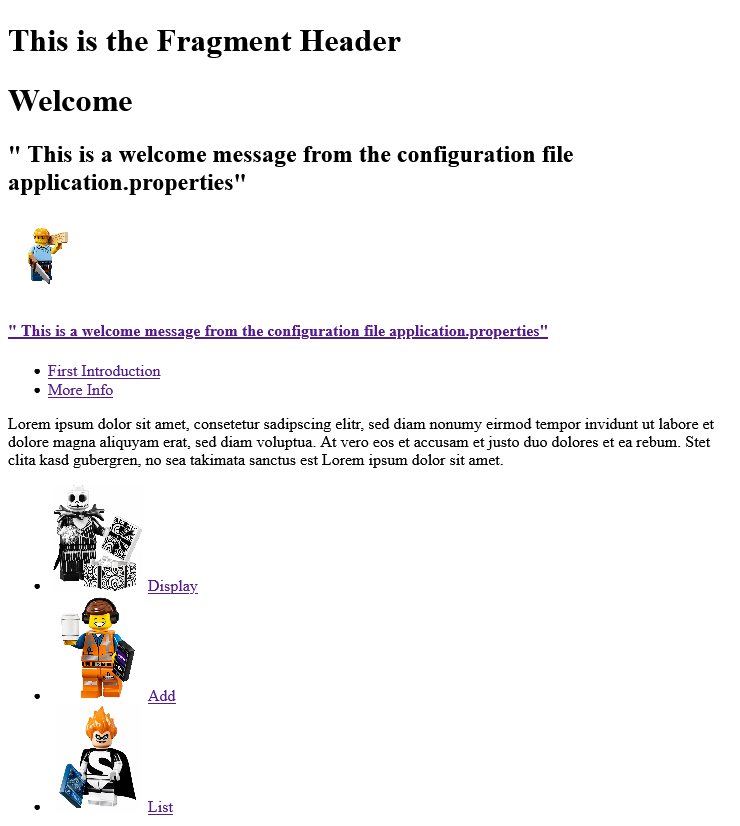
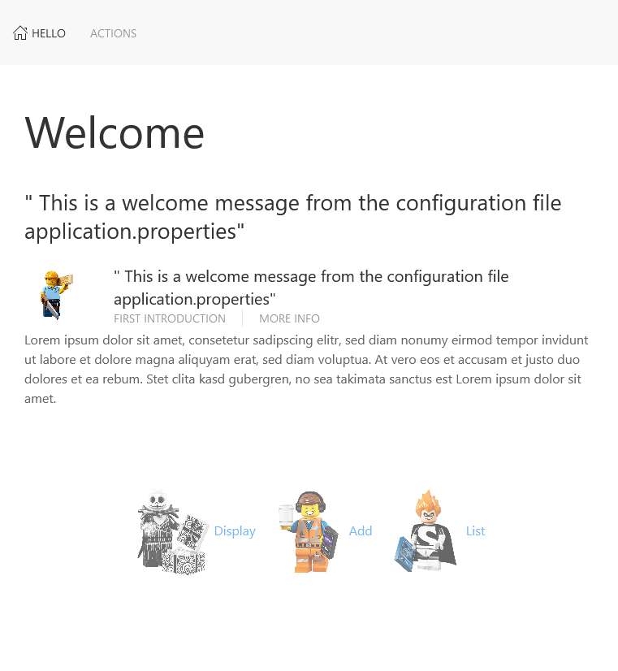
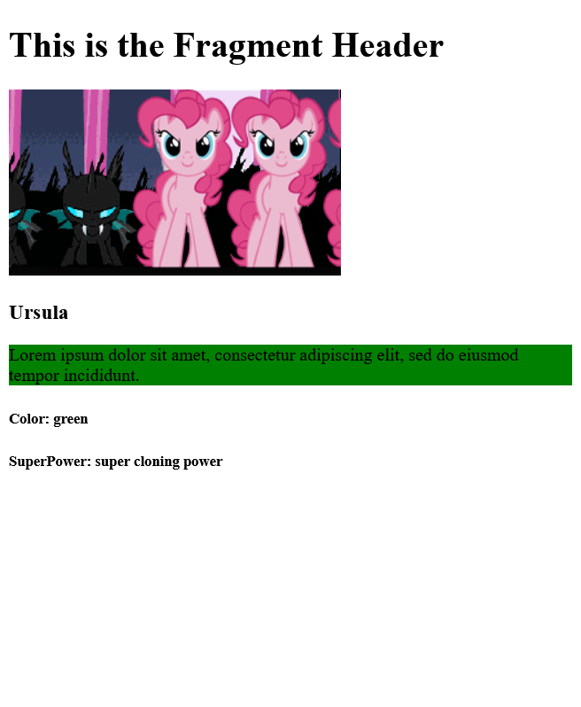
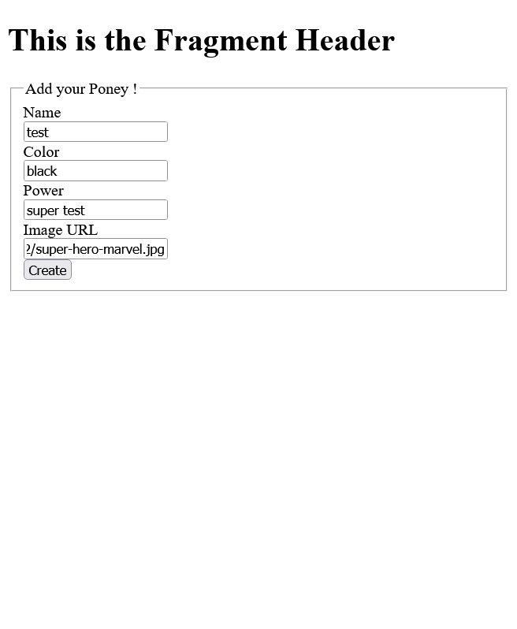
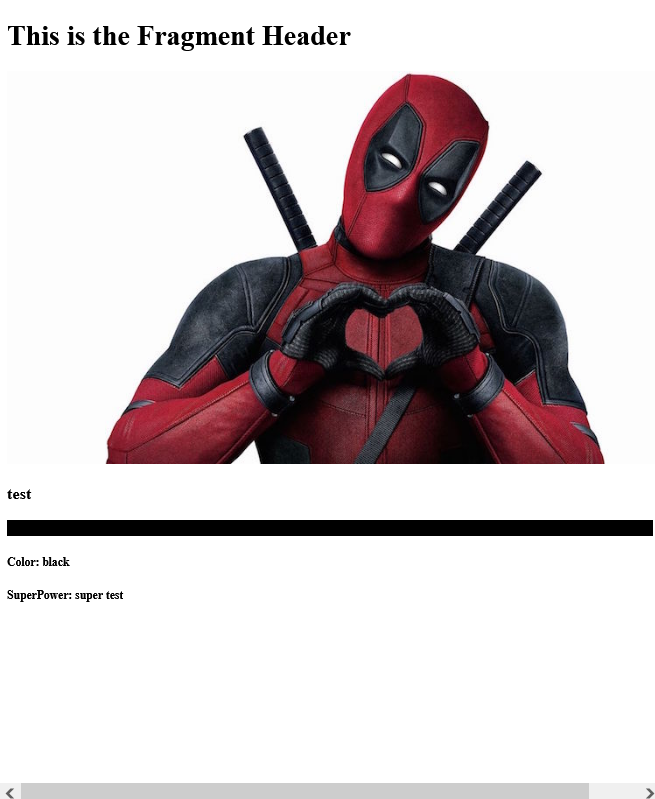
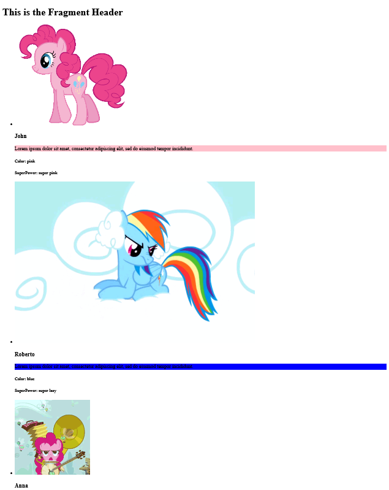

**Author**: Jacques Saraydaryan, All rights reserved
# Step 1: Création d'une application Springboot: Web Dynamique
Le tutoriel suivant permet de créer un controller HTTP définissant des routes (endpoint) et permettant d'afficher des pages dynamiquement complétées (templating).
Durant le tutoriel, deux types de visuels seront présentés. Un visuel simple et un visuel utilisant UIKit [https://getuikit.com/](https://getuikit.com/), le contenu des fichiers de ce dernier est disponible dans le répertoire `src/main/resources/templates/uk`.

## 1 Création de l'application
- Suivre les étapes de la [Step0](../step0/README.md) et créer un projet SpringBoot avec les propriétés suivantes:
  - ```GroupeId```: com.tuto.springboot
  - ```ArtefactId```: SPWebAppStep1
  - ```Packaging```: jar

- Ajouter la dépendance suivante :
```
<dependencies>
...
  <dependency>
      <groupId>org.springframework.boot</groupId>
      <artifactId>spring-boot-starter-thymeleaf</artifactId>
    </dependency>
  </dependencies>
```
- Cette dépendance va permettre d'utiliser le moteur de templating (template de page html complété coté server) `Thymeleaf` par Springboot
- `Thymeleaf` est un moteur de templating java orienté serveur. L'idée principale est d'insérer dans les balises HTML des éléments propres au moteur de template afin que le DOM puisse être modifié dynamiquement.
- Plus de détails sont disponibles sur le site officiel de `Thymeleaf` [https://www.thymeleaf.org](https://www.thymeleaf.org)
- Dans le répertoire `src/main/resources` créer les répertoires suivants:
  - `templates`: contiendra les templates HTML compléter par le server Web
  - `static`: contiendra les fichiers statiques envoyés directement au web browser (e.g, css, js, img, html static...)

## 2 Création d'un premier template Thymeleaf
### 2.1 Création d'un controller Http
- Dans le répertoire `src/main/java`, créer le package `com.sp.controller`
- Dans le package `com.sp.controller`, créer le fichier `RequestCrt.java` comme suit:
  <details open>
    <summary><b>RequestCrt.java</b></summary>

    ```java
    package com.sp.controller;

    import org.springframework.stereotype.Controller;
    import org.springframework.ui.Model;
    import org.springframework.web.bind.annotation.RequestMapping;
    import org.springframework.web.bind.annotation.RequestMethod;

    @Controller 
    public class RequestCrt {
    
    	private static String messageLocal="Lorem ipsum dolor sit amet, consetetur sadipscing elitr, sed diam nonumy eirmod tempor invidunt ut labore et dolore magna aliquyam erat, sed diam voluptua. At vero eos et accusam et justo duo dolores et ea rebum. Stet clita kasd gubergren, no sea takimata sanctus est Lorem ipsum dolor sit amet.";

    	@RequestMapping(value = { "/", "/index" }, method = RequestMethod.GET)
    	public String index(Model model) {
    		model.addAttribute("messageLocal", messageLocal);
    		return "index";
    	}

    }
  ```


  </details>

  
- Explications:

  ```java
  ...
  @Controller 
  public class RequestCrt {
  ...
  ```
  - `@Controller` : annotation indiquant à Springboot que la classe courante sera un controller http (pourra intercepter les requètes http) et que SpringBoot gérera son cycle de vie. Cette classe sera détectée automatiquement par le scanning auto du classpath.
  
  ```java
  ...
	@RequestMapping(value = { "/", "/index" }, method = RequestMethod.GET)
	public String index(Model model) {
		model.addAttribute("messageLocal", messageLocal);
		return "index";
	}
  ...
  ```
  - `@RequestMapping` : annotation indiquant de la fonction courante sera déclenchée lors d'un appel HTTP spécifique. Ici la fonction `index(...)` sera déclenchée d'une requète HTTP: GET URL: "/" ou URL: "/index"
    - `value = { "/", "/index" }`: URL attendue pour déclencher la fonction
    - `method = RequestMethod.GET` : Méthode HTTP attendue pour déclencher la fonction
  - `public String index(Model model) {...}` : Fonction déclenchée lors de l'appel HTTP spécifique. `Model model` contient tous les attributs associés à la requête HTTP, servira également à en ajouter de nouveau si nécessaire (e.g `model.addAttribute("messageLocal", messageLocal);` )
  - `return "index";` si aucune autre indication est apportée (e.g une autre annotation précisant la nature du retour), Sprinboot cherchera a retourner un fichier `index.html` contenu dans le répertoire `templates`

### 2.2 Création du template index.html
- Dans le répertoire `src/main/resources/templates` ajouter le fichier `index.html` comme suite:
  <details open>
    <summary><b>index.html</b></summary>

    ```html
    <!DOCTYPE HTML>
      <html xmlns:th="http://www.thymeleaf.org">
      <head>
      <meta charset="UTF-8" />
      <title>Welcome</title>
      <link rel="stylesheet" type="text/css" th:href="@{/static/style.css}" />

      </head>
      <body>
	        <h1>Welcome</h1>
          <div>
		        <p th:utext="${messageLocal}">...</p>
	        </div>
      </body>
    </html>
    ```
  </details>

- Explications:
  ```html
    <html xmlns:th="http://www.thymeleaf.org">
  ```
    - ` xmlns:th="..." ` : déclaration d'un DTD (Document Type Definition) permettant d'utiliser des balises et des attributs spécifiques à Thymeleaf dans ce fichier HTML (ces derniers seront utilisés à l'aide du tag `th:`)

  ```html
    <h2 th:utext="${message}">..!..</h2>
  ```
  - `th:utext="..."` : Evalue l'expression qui suit et affecte la valeur de cette évaluation au tag en question. Cette approche est particulièrement utile pour remplacer dynamiquement du text dans les documents. le texte de remplacement peur être définit:
    -  Dans des fichiers de configuration .properties ou i18n par exemple)
    -  Dans les attributs Http 
    - Plus d'information est disponible ici [thymeleaf.org .. using-texts](https://www.thymeleaf.org/doc/tutorials/2.1/usingthymeleaf.html#using-texts)
  - `${...}` : Thymeleaf propose un ensemble d'expressions ([thymeleaf.org .. standard-expression-syntax](https://www.thymeleaf.org/doc/tutorials/3.0/usingthymeleaf.html#standard-expression-syntax)) référençant des variables ou messages:
    - `${...}` Variable Expressions
    - `*{...}` Selection Variable Expressions
    - `#{...}` Message Expressions
    - `@{...}` Link URL Expressions
    - `~{...}` Fragment Expressions
  - Dans notre cas `${messageLocal}` désigne le contenu d'un attribut HTTP contenu à la clé `messageLocal`

- Compiler et exécuter votre application, Le résultat obtenu lors de l'ouverture d'un web browser à l'adresse `localhost:8080\` doit être le suivant:
  
| Simple | UIKit |
| --- | ----------- |
|   | |

### 2.3 Modification du template index.html
- Dans le répertoire `src/main/resources/static` créer un dossier image.
- Ajouter dans ce dossier 4 images (e.g img1.jpg,img2.jpg,img3.jpg,img4.jpg)
- Modifier le fichier `index.html` afin d'afficher l'une de ces images comme suit:
 <details open>
    <summary><b>index.html</b> </summary>
  
  ```html
      <!DOCTYPE HTML>
        <html xmlns:th="http://www.thymeleaf.org">
        <head>
          <meta charset="UTF-8" />
          <title>Welcome</title>
          <link rel="stylesheet" type="text/css" th:href="@{/static/style.css}" />
        </head>
        <body>
      	  <h1>Welcome</h1>
	        <div>
	        	
	        	<ul>
	        		<li><a href="#">First Introduction</a></li>
	        		<li><a href="#">More Info</a></li>
	        	</ul>
	        </div>
	        <div>
	        <p th:utext="${messageLocal}">...</p>
	        </div>
          </body>
      </html>
  ```
  </details>

- Completer votre page en ajoutant un header. Nous allons utiliser les `fragments` de Thymeleaf pour cela.
  - Dans le répertoire `src/main/resources/templates` créer le répertoire `fragments`
  - Dans ce répertoire créer le fichier `header.html` comme suit:
    <details open>
    <summary><b>header.html</b> </summary>
  
    ```html
    <!DOCTYPE HTML>
    <html xmlns:th="http://www.thymeleaf.org">
    <head>
    <meta charset="UTF-8" />
    <title>HEADER</title>
    <link rel="stylesheet" type="text/css" th:href="@{/css/style.css}" />
    </head>
    <body>
    
    	<div th:fragment="header">
    		<h1>This is the Fragment Header</h1>
    	</div>
    </body>
    </html>
    ```
    </details>

    - Explications:
      - `th:fragment="header"` : indication permettant à Thymeleaf à déclarer un code qui pourra être inséré dans une autre page.
  - Afin d'insérer le Header, ajouter les éléments suivants dans le le fichier `index.html`
    ```html
        ...
      	<div th:replace="fragments/header :: header">
	  	    <h1> THIS IS A DEFAULT HEADER</h1>
	      </div>
        ...
    ```
    - Explications
      - ` th:replace="fragments/header :: header"` : cet attribut permet de remplacer le contenu du tab par celui du fragment cible:
        - `fragments/header` : localisation du fichier qui contient les fragments
        - `:: header` : nom du fragment au sein du fichier cible (e.g définit par `th:fragment=...` comme vu au-dessus)
      - d'autres actions sur les fragments existent:
        - `th:insert` : insère le fragment spécifié dans le corps du tag HTML courant.
        - `th:replace` remplace le tag courant par le fragment spécifié.
        - `th:include` similaire à `th:insert`,  mais à la place d'insérer le fragment, insère le contenu du fragment.
    - Des informations détaillées sont disponibles ici ([thymeleaf.org .. template-layout](https://www.thymeleaf.org/doc/tutorials/3.0/usingthymeleaf.html#template-layout))

  - Ajout d'un message provenant d'un fichier de configuration
    - Le fichier `application.properties` contient la configuration du serveur springboot. Ajouter la ligne suivante dans le fichier `src/main/resources/application.properties` :

    ```
    ...
    welcome.message= " This is a welcome message from the configuration file application.properties"

    ```
  - Modifier le fichier `RequestCrt.java` comme suit pour prendre en compte l'information du fichier de configuration `application.properties`:
    <details open>
      <summary><b>RequestCrt.java</b> </summary>
    
    ```java
      package com.sp.controller;

      import org.springframework.beans.factory.annotation.Autowired;
      import org.springframework.beans.factory.annotation.Value;
      import org.springframework.stereotype.Controller;
      import org.springframework.ui.Model;
      import org.springframework.web.bind.annotation.ModelAttribute;
      import org.springframework.web.bind.annotation.RequestMapping;
      import org.springframework.web.bind.annotation.RequestMethod;
      
      @Controller // AND NOT @RestController
      public class RequestCrt {
      
      	@Value("${welcome.message}")
      	private String message;
      
      	private static String messageLocal="Lorem ipsum dolor sit amet, consetetur sadipscing elitr, sed diam nonumy eirmod tempor invidunt ut labore et dolore magna aliquyam erat, sed diam voluptua. At vero eos et accusam et justo duo dolores et ea rebum. Stet clita kasd gubergren, no sea takimata sanctus est Lorem ipsum dolor sit amet.";
      
      	@RequestMapping(value = { "/", "/index" }, method = RequestMethod.GET)
      	public String index(Model model) {
        
      		model.addAttribute("message", message);
      		model.addAttribute("messageLocal", messageLocal);
      
      		return "index";
      	}
      ```

    </details>
    - Explications:
  
      ```java
        ...
        @Value("${welcome.message}")
        private String message;
        ...
      ```

      - `@Value("${welcome.message}")` : annotation qui permet de récupérer les valeurs du fichier de configuration `application.properties`.
      ```java
        ...
        model.addAttribute("message", message);
        ...
      ```
    - `model.addAttribute(...)` : ajoute un attribut à la requète Http permettant d'être récupéré par la suite par le fichier `index.html`.
  - Modifier le fichier `index.html` afin qu'il affiche ce nouvel attribut comme suit :
    <details open>
      <summary><b>index.html</b> </summary>

      ```html
        <!DOCTYPE HTML>
        <html xmlns:th="http://www.thymeleaf.org">
        <head>
        <meta charset="UTF-8" />
        <title>Welcome</title>
        <link rel="stylesheet" type="text/css" th:href="@{/css/style.css}" />

        </head>
        <body>	
        	<div th:replace="fragments/header :: header">
        		<h1> THIS IS A DEFAULT HEADER</h1>
        	</div>
        	<h1>Welcome</h1>
        	<h2 th:utext="${message}">..!..</h2>
        	<div>
        		
        		<h4>
        			<a href="#" th:utext="${message}">...</a>
        		</h4>
        		<ul>
        			<li><a href="#">First Introduction</a></li>
        			<li><a href="#">More Info</a></li>
        		</ul>
        	</div>
        	<div>
        		<p th:utext="${messageLocal}">...</p>
        	</div>
        	<div>
        		<ul>
        			<li><a href="/view">Display</a></li>
        			<li><a href="/addPoney">Add</a></li>
        			<li><a href="/list">List</a></li>
        		</ul>
        	</div>
        </body>
        </html>
      ```
    
    </details>

  - Compiler et exécuter votre application, Le résultat obtenu lors de l'ouverture d'un web browser à l'adresse `localhost:8080\`  doit être le suivant:

| Simple | UIKit |
| --- | ----------- |
|   | |

## 3 Affichage de données DAO et Model
### 3.1 Création du DAO et Model
- Dans le répertoire `src/main/java`créer le package `com.sp.model`
- Créer dans ce package la classe `Poney.java` comme suit:
    <details open>
      <summary><b>Poney.java</b> </summary>

    ```java
    package com.sp.model;
    public class Poney  {
    	private String color;
    	private String superPower;
    	private String name;
    	private String imgUrl;

    	public Poney() {
    		this.color = "";
    		this.superPower = "";
    		this.name = "";
    		this.imgUrl="";
    	}
    	public Poney(String name,String color,String superPower, String imgUrl) {
    		this.color = color;
    		this.superPower = superPower;
    		this.name = name;
    		this.imgUrl=imgUrl;
    	}

      // GETTER AND SETTER
    }
  ```
    </details>
  - Une fois le model créé, il est nécessaire de créer un controlleur permettant d'interagir avec ce derner. Dans le package `com.sp.controller`, créer le controlleur `PoneyDao.java` comme suit:
    <details open>
      <summary><b>Poney.java</b> </summary>

    ```java
    package com.sp.controller;

    import java.util.ArrayList;
    import java.util.List;
    import java.util.Random;

    import org.springframework.stereotype.Service;

    import com.sp.model.Poney;

    @Service
    public class PoneyDao {
    	private List<Poney> myPoneyList;
    	private Random randomGenerator;

    	public PoneyDao() {
    		myPoneyList=new ArrayList<>();
    		randomGenerator = new Random();
    		createPoneyList();
    	}

    	private void createPoneyList() {
      
    		Poney p1=new Poney("John", "pink", "super pink", "http://ekladata.com/9-cPSlYvrenNHMVawFmf_gLx8Jw.gif");
    		Poney p2=new Poney("Roberto", "blue", "super lazy", "http://ekladata.com/JEVyY9DkwX4vVkakeBfikSyPROA.gif");
    		Poney p3=new Poney("Anna", "orange", "super music girl", "http://ekladata.com/fMJl--_v-3CmisaynTHju1DMeXE.gif");
    		Poney p4=new Poney("Angry Joe", "purple", "super angry power", "http://ekladata.com/AmbNNNvv-4YFEMZR8XD8e54WoHc.gif");
    		Poney p5=new Poney("Ursula", "green", "super cloning power", "http://ekladata.com/CXJhi2YLUbNz6__e0Ct6ZP-XOds.gif");

    		myPoneyList.add(p1);
    		myPoneyList.add(p2);
    		myPoneyList.add(p3);
    		myPoneyList.add(p4);
    		myPoneyList.add(p5);
    	}
    	public List<Poney> getPoneyList() {
    		return this.myPoneyList;
    	}
    	public Poney getPoneyByName(String name){
    		for (Poney poneyBean : myPoneyList) {
    			if(poneyBean.getName().equals(name)){
    				return poneyBean;
    			}
    		}
    		return null;
    	}
    	public Poney getRandomPoney(){
    		int index=randomGenerator.nextInt(this.myPoneyList.size());
    		return this.myPoneyList.get(index);
    	}

    	public Poney addPoney(String name, String color, String superPower, String imgUrl) {
    		Poney p=new Poney(name, color, superPower, imgUrl);
    		this.myPoneyList.add(p);
    		return p;
    	}
    }

    ```
    </details>

    - Explications

      - Cette classe va permettre de créer une liste de modèles par défaut et des méthodes permettant d'accéder et de manipuler cette liste
      ```java
      ...
       @Service
      public class PoneyDao {
        ...
        }
      ```
      - `@Service` : annotation Sprinboot qui permet de créer une instance de la classe qui sera gérée par Springboot (cycle de vie). Cette classe pourra ainsi être injectée dans d'autres classes.
  - Modifier le fichier `RequestCrt.java` afin de retourner une vue affichant un poney.
      <details open>
        <summary><b>RequestCrt.java</b> </summary>

      ```java

	        @Autowired
	        PoneyDao poneyDao;
          ...
           	@RequestMapping(value = { "/view"}, method = RequestMethod.GET)
	            public String view(Model model) {
	            model.addAttribute("myPoney",poneyDao.getRandomPoney() );
		          return "poneyView";
	          }
          ...
      ```
      </details>

      - Explications:
        - `@Autowired` : annotation qui permet l'injection de dépendance à savoir une instance de PoneyDao (couplage faible)
        - `@RequestMapping(value = { "/view"}, method = RequestMethod.GET)`: Annotation qui définit une nouvelle route sur le serveur Web pour un HTTP GET
        - `model.addAttribute("myPoney",poneyDao.getRandomPoney() );`: ajoute un attribut (object poney choisit aléatoirement) à la requète Http permettant d'être récupéré par la suite par le fichier `poneyView.html`.
  - Dans le répertoire `src/main/resources/templates`, créer le fichier `poneyView.html` comme suit afin d'afficher le contenu d'un object Poney.
      <details open>
        <summary><b>RequestCrt.java</b> </summary>

      ```html
          <!DOCTYPE HTML>
          <html xmlns:th="http://www.thymeleaf.org">
          <head>
          <meta charset="UTF-8" />
          <title>Welcome</title>
          <link rel="stylesheet" type="text/css" th:href="@{/css/style.css}" />
          </head>
          <body>
          	<div th:replace="fragments/header :: header">
          		<h1> THIS IS A DEFAULT HEADER</h1>
          	</div>
          	<div>
          		

          		<h3 th:utext="${myPoney.name}">...</h3>

          		<div th:style="'background-color:'+${myPoney.color}">
          			<p>
          				Lorem ipsum dolor sit amet, consectetur adipiscing elit, sed
          				do eiusmod tempor incididunt.
          			</p>	
          		</div>

          		<h5 th:text="'Color:  '+${myPoney.color}">...</h5>
          		<h5 th:text="'SuperPower:  '+${myPoney.superPower}">...</h5>
          	</div>
          </body>
          </html>
      ```
      </details>

      - Explications:
        - `th:src="${myPoney.imgUrl}"`: Attribut de thymeleaf (`th:src`) permettant de renseigner la source d'une image. `${myPoney.imgUrl}"` récupère l'attribut pour clé `myPoney` et spécifiquement l'attribut `imgUrl` de l'objet contenu à la clé spécifiée.
        - Afin de récupérer l'attribut visé (e.g `imgUrl`), les getter et setter de l'objet `Poney.java` seront utilisés (ici `getImgUrl()` de la classe `Poney`)
  - Compiler et exécuter votre application, Le résultat obtenu lors de l'ouverture d'un web browser à l'adresse `localhost:8080\view`  doit être le suivant:

  | Simple | UIKit |
  | --- | ----------- |
  |   | |


# 4 Manipulation de Poney
## 4.1 Création de Poney
  - Créer une Classe java DTO (Data Transfert Object) `PoneyFormDTO.java` dans `src.main.java.com.sp.model` permettant de recevoir la construction d'un poney.
    <details open>
      <summary><b>PoneyFormDTO.java</b> </summary>

    ```java
    public class PoneyFormDTO  {
    
    	private String color;
    	private String superPower;
    	private String name;
    	private String imgUrl;

    	public String getImgUrl() {
    		return imgUrl;
    	}
    	public void setImgUrl(String imgUrl) {
    		this.imgUrl = imgUrl;
    	}
    	public PoneyFormDTO() {
    		this.color = "";
    		this.superPower = "";
    		this.name = "";
    		this.imgUrl="";
    	}
    	public PoneyFormDTO(String name,String color,String superPower, String imgUrl) {
    		this.color = color;
    		this.superPower = superPower;
    		this.name = name;
    		this.imgUrl=imgUrl;
    	}

        // GETTER AND SETTER

    ```
    </details>


  - Modifier le fichier `RequestCrt.java` afin qu'il accèpte une requête d'ajout d'un poney.

    <details open>
      <summary><b>RequestCrt.java</b> </summary>

    ```java
        ...
          @RequestMapping(value = { "/addPoney"}, method = RequestMethod.GET)
	        public String addponey(Model model) {
	        	PoneyFormDTO poneyForm = new PoneyFormDTO();
	        	model.addAttribute("poneyForm", poneyForm);
	        	return "poneyForm";
	        }

          @RequestMapping(value = { "/addPoney"}, method = RequestMethod.POST)
	        public String addponey(Model model, @ModelAttribute("poneyForm") PoneyFormDTO poneyForm) {
          Poney p=poneyDao.addPoney(poneyForm.getName(),poneyForm.getColor(),poneyForm.getSuperPower(),poneyForm.getImgUrl());
		      model.addAttribute("myPoney",p );
		      return "poneyView";
        ...
    ```
    </details>

    - Explications:
      - `@RequestMapping(value = { "/addPoney"}, method = RequestMethod.GET)` : Annotation qui définit une nouvelle route sur le serveur Web pour un HTTP GET et de retourner la page du formulaire (`return "poneyForm";`).
      - `@RequestMapping(value = { "/addPoney"}, method = RequestMethod.POST)` : Annotation qui définit une nouvelle route sur le serveur Web pour un HTTP POST
      - `@ModelAttribute("poneyForm") PoneyFormDTO poneyForm` : annotation qui permet de récupérer le contenu d'un attribut d'une requète HTTP et de le tranformer en object java (ici `PoneyFormDTO`). Cette transformation est réalisée par Springboot en utilisant des outils (e.g jackson) permettant de convertir un formulaire ou un object Json en object Java.
      - `Poney p=poneyDao.addPoney(...)` : utilise le DAO afin de créer un poney à partir du DTO reçu
      - `model.addAttribute("myPoney",p );` : ajoute le poney créé aux attributs de la requète http
      - `return "poneyView";` : renvoie l'utilisateur vers la page `poneyView.html`

  - Créer dans le répertoire `src/main/resources/templates` créer le fichier `poneyForm.html` permettant de créer un poney

    <details open>
      <summary><b>poneyForm.html</b> </summary>

    ```html
    <!DOCTYPE HTML>
    <html xmlns:th="http://www.thymeleaf.org">
    <head>
    <meta charset="UTF-8" />
    <title>Welcome</title>
    <link rel="stylesheet" type="text/css" th:href="@{/css/style.css}" />

    </head>
    <body>
    		<div th:replace="fragments/header :: header">
    		<h1> THIS IS A DEFAULT HEADER</h1>
    	</div>
    	<form th:action="@{/addPoney}"
             th:object="${poneyForm}" method="POST">
    		<fieldset >
    			<legend >Add your Poney ! </legend>
    			<div >
    				<label for="form-name">Name</label>
    				<div >
    					<input id="form-name" type="text"
    						placeholder="Poney name..." th:field="*{name}">
    				</div>
    			</div>
    			<div >
    				<label  for="form-color">Color</label>
    				<div >
    					<input  id="form-color" type="text"
    						placeholder="Poney main color..." th:field="*{color}">
    				</div>
    				<label  for="form-superPower">Power</label>
    				<div >
    					<input id="form-superPower" type="text"
    						placeholder="Poney super power..." th:field="*{superPower}">
    				</div>
    				<label  for="form-imgUrl">Image URL</label>
    				<div >
    					<input  id="form-imgUrl" type="text"
    						placeholder="Poney super power..." th:field="*{imgUrl}">
    				</div>
    			</div>
    			<div >
    				<input type="submit"  class="uk-button uk-button-default" value="Create" />
    			</div>

    		</fieldset>
    	</form>

    </body>

    </html>
    ```
    </details>

  - Compiler et exécuter votre application, Le résultat obtenu lors de l'ouverture d'un web browser à l'adresse `localhost:8080\addPoney`  doit être le suivant:

  | Simple | UIKit |
  | --- | ----------- |
  |   | |
  |   | |

## 4.1 Affichage d'une liste de Poney
  - Modifier le ficher `RequestCrt.java` afin qu'il accèpte une nouvelle route et affiche la liste des poneys disponibles.

  <details open>
      <summary><b>RequestCrt.java</b> </summary>

  ```java
    ...
	  @RequestMapping(value = { "/list"}, method = RequestMethod.GET)
	  public String viewList(Model model) {
		  model.addAttribute("poneyList",poneyDao.getPoneyList() );
		  return "poneyViewList";
	  }
    ...
  ```
  </details>

  - Ajouter le fichier `poneyViewList.html` dans le répertoire `src/main/resources/templates`, afin d'afficher une liste d'objets Poney.

  <details open>
      <summary><b>RequestCrt.java</b> </summary>

  ```java
    <!DOCTYPE HTML>
    <html xmlns:th="http://www.thymeleaf.org">
    <head>
    <meta charset="UTF-8" />
    <title>Welcome</title>
    <link rel="stylesheet" type="text/css" th:href="@{/css/style.css}" />
    </head>
    <body>
    	<div th:replace="fragments/header :: header">
    		<h1> THIS IS A DEFAULT HEADER</h1>
    	</div>
    	<ul>
    		<li th:each="poney : ${poneyList}">
    			<div>
    				
    				<h3 th:utext="${poney.name}">...</h3>
    				<div th:style="'background-color:'+${poney.color}">
    					<p>Lorem ipsum dolor sit amet, consectetur adipiscing elit, sed
    						do eiusmod tempor incididunt.</p>
    				</div>
    				<h5 th:text="'Color:  '+${poney.color}">...</h5>
    				<h5 th:text="'SuperPower:  '+${poney.superPower}">...</h5>
    			</div>
    		<li>
    	</ul>
    </body>
    </html>
  ```
  </details>

  - Explications:
      - `th:each="poney : ${poneyList}"` : annotation Thymeleaf permettant de répéter plusieurs fois le contenu du tag Html en question. Ici on récupère la liste contenu à la clé `poneyList` dans la liste des attributs. A chaque répétition un élément de la liste est placé dans la variable `poney` et peut être utilisé à l'intérieur du tag répété (e.g `<h3 th:utext="${poney.name}">...</h3>`)

- Compiler et exécuter votre application, Le résultat obtenu lors de l'ouverture d'un web browser à l'adresse `localhost:8080\list`  doit être le suivant:

  | Simple | UIKit |
  | --- | ----------- |
  |   | |
